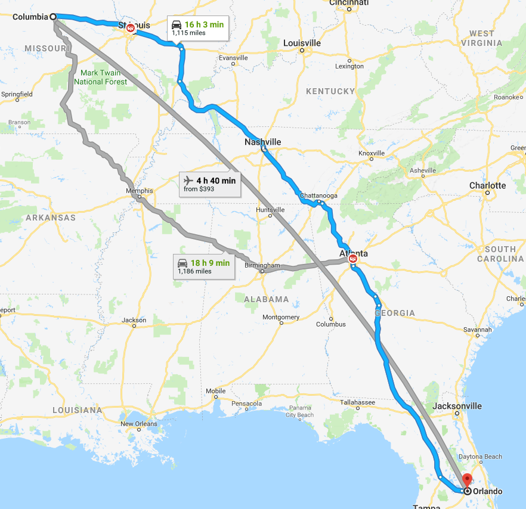

# Travel

### Traveling will be done by car
We will take the highway from CoMO to STL, then down to Atlanta and finally to Orlando

- 1,115 miles
- 16 hours + 30/40 minutes for food & fuel stops
- This trip will require 37.17 gallons of gas
- Fuel cost of $92.92 at 30mpg
- Including tolls, travel cost will be ~$100

